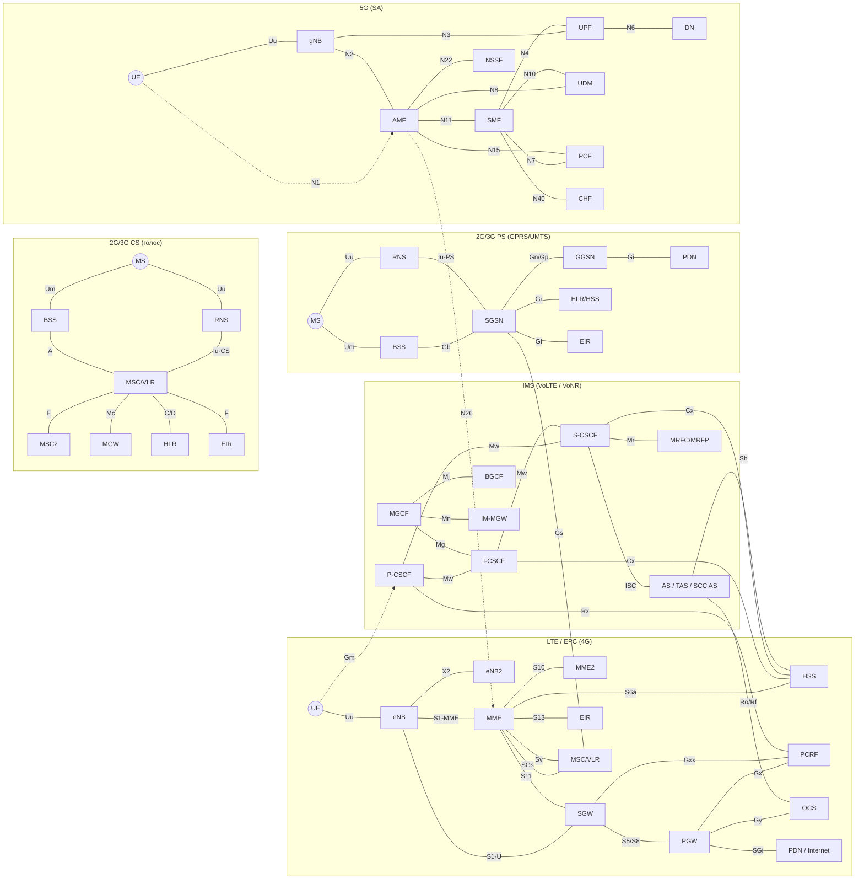

# 12. Промт для генератора изображений (схема интерфейсов)

## Что уже готово в комплекте

- `11_Schema_interfejsov.svg` — точная векторная схема (открывается в браузере, редактируется в векторных редакторах).
- `11_Schema_interfejsov.png` — растровая версия 4800×3320 (для презентаций и печати).

Промт ниже — если нужен «нарисованный» вариант (плакат, инфографика) от нейросети
(DALL·E, Midjourney, Stable Diffusion и др.). Учтите: генераторы плохо воспроизводят
длинные точные подписи — для учебного материала надёжнее SVG/PNG из комплекта
или Mermaid-исходник в конце файла.

## Промт (русский)

> Нарисуй детальную техническую схему интерфейсов мобильной сети для учебного плаката.
> Стиль: плоская векторная инфографика, белый фон, без градиентов и теней, аккуратные
> скруглённые прямоугольники-узлы с короткими подписями, соединительные линии разных
> цветов по типу протокола. Пять подписанных зон: LTE/EPC (UE, eNB, MME, SGW, PGW, HSS,
> PCRF, OCS, EIR, MSC); IMS (P-CSCF, I-CSCF, S-CSCF, HSS, TAS, MGCF, IM-MGW, BGCF);
> 2G/3G PS (MS, BSS, RNS, SGSN, GGSN, HLR, EIR); 2G/3G CS (MS, BSS, RNS, MSC/VLR, MGW,
> HLR, EIR); 5G SA (UE, gNB, AMF, SMF, UPF, UDM, PCF, NSSF, CHF, DN). Цвета линий:
> синий — радио и доступ (Uu, X2, S1-MME); зелёный — данные (S1-U, SGi, Gi, N3, N6);
> фиолетовый — Diameter (S6a, S13, Gx, Gy, Rx, Cx, Sh, Sv); красный — CS/SS7 (A, Iu-CS,
> E, C/D, F, Gs, SGs); оранжевый — IMS/SIP (Gm, Mw, ISC, Mg, Mi, Mj, Mn, Mr); коричневый —
> legacy PS (Gb, Iu-PS, Gn, Gi, Gr, Gf); тёмно-синий — 5G управление (N1, N2, N4, N11, N26);
> малиновый — 5G SBI (N8, N10, N15, N22, N40). Подпиши каждую линию именем интерфейса,
> внизу — легенду цветов. Формат 16:9, высокое разрешение, чистый шрифт без засечек,
> подписи на русском языке.

## Prompt (English)

> Create a detailed technical infographic of mobile network interfaces for an educational
> wall chart. Flat vector style, white background, no gradients or shadows. Nodes are clean
> rounded rectangles with short labels; connection lines are color-coded by protocol family:
> blue = radio/access (Uu, X2, S1-MME); green = user data (S1-U, SGi, Gi, N3, N6);
> purple = Diameter (S6a, S13, Gx, Gy, Rx, Cx, Sh, Sv); red = CS/SS7 (A, Iu-CS, E, C/D, F,
> Gs, SGs); orange = IMS/SIP (Gm, Mw, ISC, Mg, Mi, Mj, Mn, Mr); brown = legacy PS (Gb,
> Iu-PS, Gn, Gi, Gr, Gf); dark blue = 5G control (N1, N2, N4, N11, N26); magenta = 5G SBI
> (N8, N10, N15, N22, N40). Label every line with its interface name and add a color legend
> at the bottom. Five labeled zones: LTE/EPC; IMS; 2G/3G PS; 2G/3G CS; 5G SA. 16:9, ultra
> high resolution, clean sans-serif typography.

## Советы по генерации

1. Нейросети часто «ломают» длинные подписи: генерируйте схему без текста, а подписи
   наносите поверх в редакторе (Figma, draw.io, Visio, PowerPoint).
2. Для Midjourney добавьте параметры: `--ar 16:9 --style raw`.
3. Просите «flat vector, technical diagram, white background, minimal text».
4. Для точной и бесплатной схемы с текстом используйте Mermaid (ниже): он рендерится
   в GitLab/GitHub, VS Code и на mermaid.live.

## Mermaid-исходник (точная схема с текстом)

Вставьте в любой рендерер Mermaid (mermaid.live, GitLab, GitHub, VS Code):

